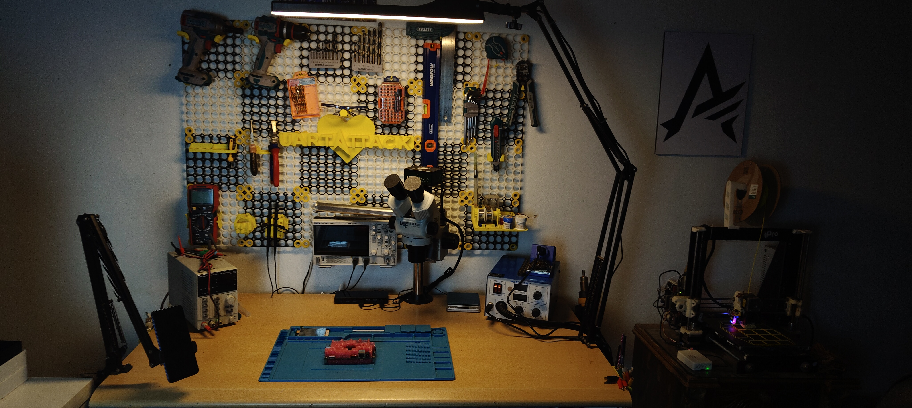

# 👋 Hello There, An Embedded Systems and IoT Expert Here

## 🔧 My Hardware Setup

### Top Rated Embedded Systems Engineer | IoT Apps & Robotics Developer 

A versatile Embedded Systems & App development Expert with +3 years of academic and freelance Experience, I bring a unique blend of expertise in robotics, embedded systems, app development. and CAD design

- Embedded Systems Expert (C/C++)
- STM32, Arduino, ESP32 boards and Raspberry PIs
- PCB Mixed Signal and High Speed Design EMI/SI
- FPGAs, Verilog/VHDL
- Assembly Language (x86, MIPS, Arm/Thumb)
- ROS Robotics, Drones, IMUs applications
- Native and Cross platform BLE/IoT Mobile App development

With hands-on experience in creating advanced projects like drones, robotic arms, IMU gloves and developing path planning and navigation systems utilizing depth cameras for autonomous robots, I excel at integrating cutting-edge technology to solve complex problems.

My skills extend to app development for Android, iOS, and web platforms, IoT apps and Sensor Integration ensuring comprehensive solutions for diverse needs.

Let's collaborate to transform your ideas into a Reality!

---

## 🚀 About Me

- 💼 Freelance Software Developer with experience in diverse projects
- 🔭 Currently working on computer vision and embedded systems projects
- 🌱 Passionate about creating accessible technology and solving real-world problems
- 💡 Strong background in algorithm design, data structures, and system optimization
- 🎯 Specialized in C++, Java, Python, and JavaScript ecosystems

---

## 🛠️ Technical Skills

### Languages

### Technologies & Frameworks
- **Embedded Systems:** ESP32, STM32 (Black Pill), Microcontroller Programming
- **System Design:** Compiler Design, Operating Systems, Control Systems
- **PCB Design:** High Speed, Multilayer PCB EMI/SI Proof Designs
- **Mobile Development:** Android, Flutter
- **Game Development:** Unity, Godot
- **Computer Vision:** OpenCV, Stereo Vision, Depth Sensing
- **Machine Learning:** Deep Learning, Object Detection, Image Processing
- **Web Development:** Full-Stack JavaScript, HTML/CSS
- **Data Compression:** Huffman Coding, Arithmetic Coding, Vector Quantization

### Development Tools

---

## 🎯 Featured Projects

### 🦯 [WalkEasyApp](https://github.com/susano254/WalkEasyApp)
An innovative Android application that assists visually impaired users by utilizing stereo camera depth information to provide 3D sound feedback about their environment.
- **Tech Stack:** C++, Android, Stereo Vision, OpenCV
- **Key Features:** Real-time depth sensing, 3D audio feedback, accessibility-focused design

### 🖥️ [Java-ish Compiler](https://github.com/susano254/Java_ish_Compiler)
A custom compiler implementation for a Java-like programming language, demonstrating deep understanding of compiler theory and design.
- **Tech Stack:** C
- **Key Features:** Lexical analysis, parsing, code generation

### 🍎 [Fruit Detection](https://github.com/susano254/FruitDetection)
Machine learning project for automated fruit recognition and classification using computer vision techniques.
- **Tech Stack:** Python, Jupyter Notebook, Deep Learning
- **Applications:** Agricultural automation, quality control

### 📺 [Subtitle Detection](https://github.com/susano254/Subtitle-detection)
Computer vision system for detecting and extracting subtitles from video content.
- **Tech Stack:** Python, OpenCV, Image Processing

### 🎮 [Control Systems](https://github.com/susano254/Control-Systems)
A 4-week project focused on stabilizing a propeller arm horizontally using PID control, Python, and web interface integration.
- **Tech Stack:** JavaScript, Python, Serial Communication
- **Key Features:** Real-time control, web-based interface

### 💰 [Finance App](https://github.com/susano254/Finance_App)
Financial management application with intuitive UI and robust backend.
- **Tech Stack:** Java

### 🏦 [Bank System](https://github.com/susano254/Bank_System_CSharp)
Complete banking system implementation demonstrating object-oriented design principles.
- **Tech Stack:** C#

---

## 📊 GitHub Stats

---

## 💼 Professional Experience

I offer comprehensive software development services including:

- ✅ **Embedded Systems** - Firmware development for microcontrollers and IoT devices
- ✅ **System Architecture** - Designing robust and maintainable software systems
- ✅ **Game Development** - Custom Hardware Controllers and Games fully developed in Unity
- ✅ **Mobile App Development** - Native Android and cross-platform Flutter apps
- ✅ **Computer Vision & ML** - Image processing, object detection, and AI solutions
- ✅ **Algorithm Design** - Data structures, optimization, and compression algorithms
- ✅ **Full-Stack Web Development** - Building responsive and scalable web applications

---

## 📫 Get In Touch

- 💼 **Upwork:** [View Profile](https://www.upwork.com/freelancers/~01220c483dbdd59b38)
- 💻 **GitHub:** [@susano254](https://github.com/susano254)
- 📧 **Email:** Available on request

---

## 🌟 What I Bring to the Table

- **Problem Solver:** Strong analytical skills and ability to tackle complex challenges
- **Fast Learner:** Quick to adapt to new technologies and frameworks
- **Quality Focused:** Write clean, maintainable, and well-documented code
- **Team Player:** Excellent communication and collaboration skills
- **Deadline Driven:** Committed to delivering projects on time and within scope

---

### 🔥 Recent Activity

<!--START_SECTION:activity-->
<!--END_SECTION:activity-->

---

  

  <i>⚡ Available for freelance projects and collaborations ⚡</i>

